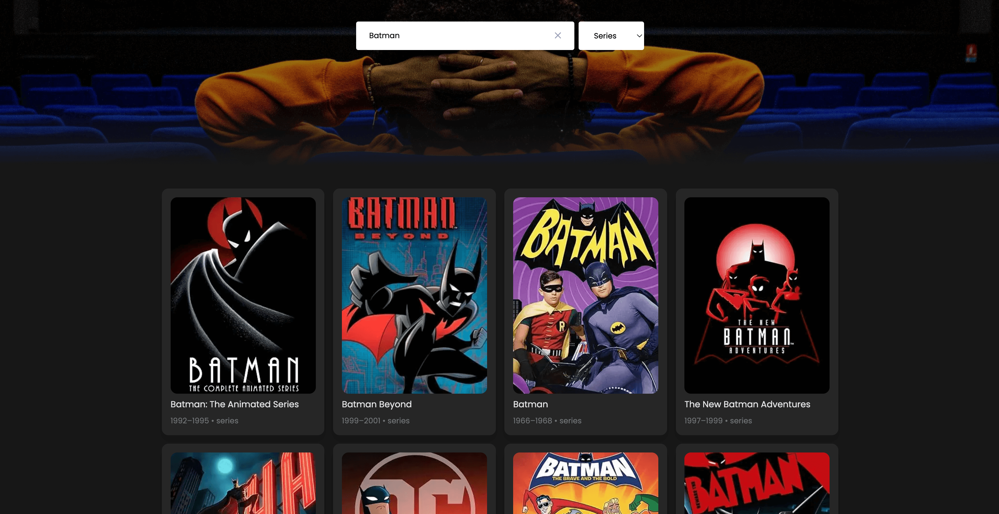
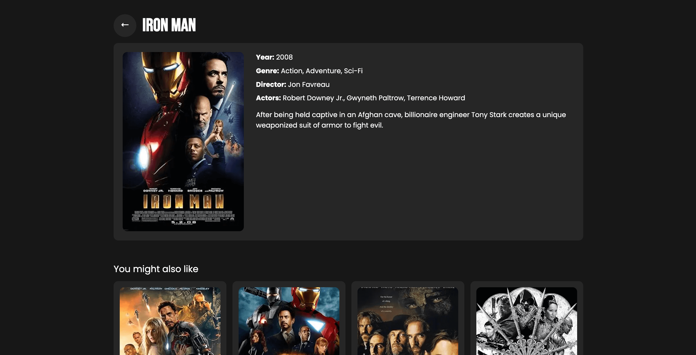

# OMDB Movie Search App

A React application built with Next.js and TypeScript that allows users to search for movies and TV shows using the OMDB API. The application follows Clean Architecture principles and provides a modern, responsive user interface.

## Features

- Search movies and TV shows by title
- Filter results by type (movies, series, or both)
- View detailed information about each title
- Responsive design using Tailwind CSS
- Infinite scroll pagination
- Error handling and loading states
- Caching with React Query
- Type-safe development with TypeScript

## Tech Stack

- **Framework**: Next.js 14
- **Language**: TypeScript
- **Styling**: Tailwind CSS
- **State Management**: Zustand
- **Data Fetching**: React Query
- **Testing**: Jest + React Testing Library
- **Architecture**: Clean Architecture

## Prerequisites

Before you begin, ensure you have:
- Node.js 18.17 or later
- npm or yarn package manager
- OMDB API Key (get it from [OMDB API](https://www.omdbapi.com/))

## Getting Started

1. Clone the repository:
```bash
git clone git@github.com:eplacencio/omdb-APP.git
cd omdb-app
```

2. Install dependencies:
```bash
npm install
# or
yarn install
```

3. Create a `.env` file in the root directory:
```env
NEXT_PUBLIC_API_SECURITY_KEY=your_omdb_api_key_here
```
Replace `your_omdb_api_key_here` with the API key obtained from [OMDB API](https://www.omdbapi.com/)

4. Run the development server:
```bash
npm run dev
# or
yarn dev
```

5. Open [http://localhost:3000](http://localhost:3000) with your browser to see the application.

## Screenshots

### Home Page

*Landing page with search functionality and featured movies*

### Search Results

*Search results showing Batman movies with filter options*

### Movie Details

*Detailed view of a movie showing comprehensive information*

## Project Structure

```
src/
├── app/                    # Next.js app router pages
├── components/             # React components
├── data/                   # Data layer (API clients)
├── domain/                 # Domain layer (models and schemas)
├── hooks/                  # Custom React hooks
├── providers/             # React providers
├── state/                 # State management
└── utils/                 # Utility functions
```

## Testing

The project includes unit tests for components and hooks. To run the tests:

```bash
# Run tests
npm test

# Run tests with coverage
npm test -- --coverage
```

## Development Guidelines

- Follow the established Clean Architecture pattern
- Write tests for new components and features
- Use TypeScript for type safety
- Follow the existing code style and formatting

## License

This project is licensed under the MIT License - see the LICENSE file for details.
